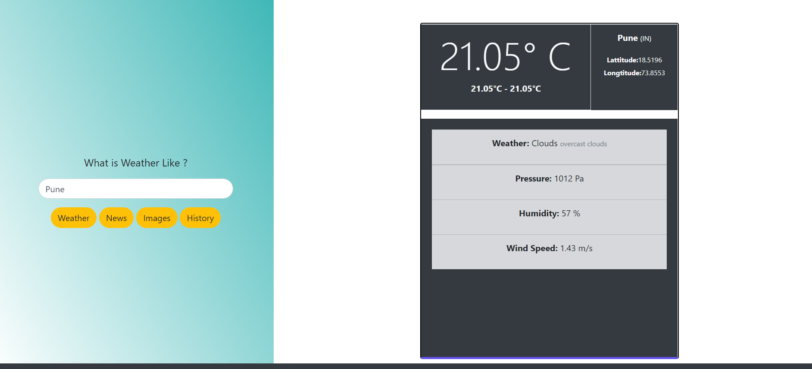
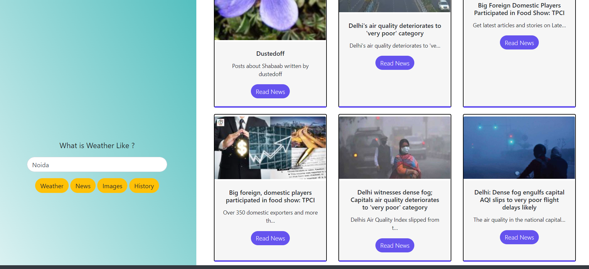
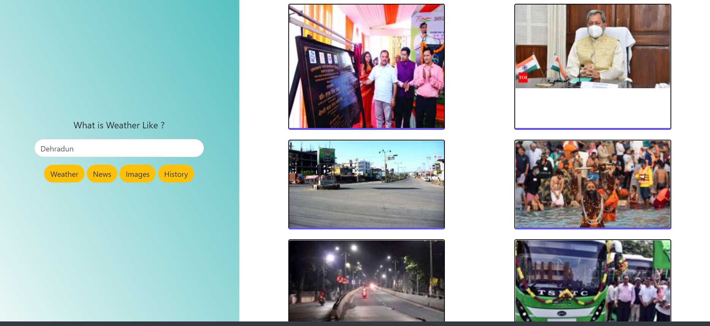

# Tourist-Utility-Webapp

It is Utility Webapp for tourist who want a quick weather report, news or images related to a city. This project is just made to get familiarize working with APIs in Django and understand usage of postman.
The APIs are taken from OpenWeatherMap and RapidAPI. Postman has been used to test the APIs. 
The following is the main page which is weather report for city Pune.

Here is the news articles for city Noida.

Here are images from city Dehradun.

